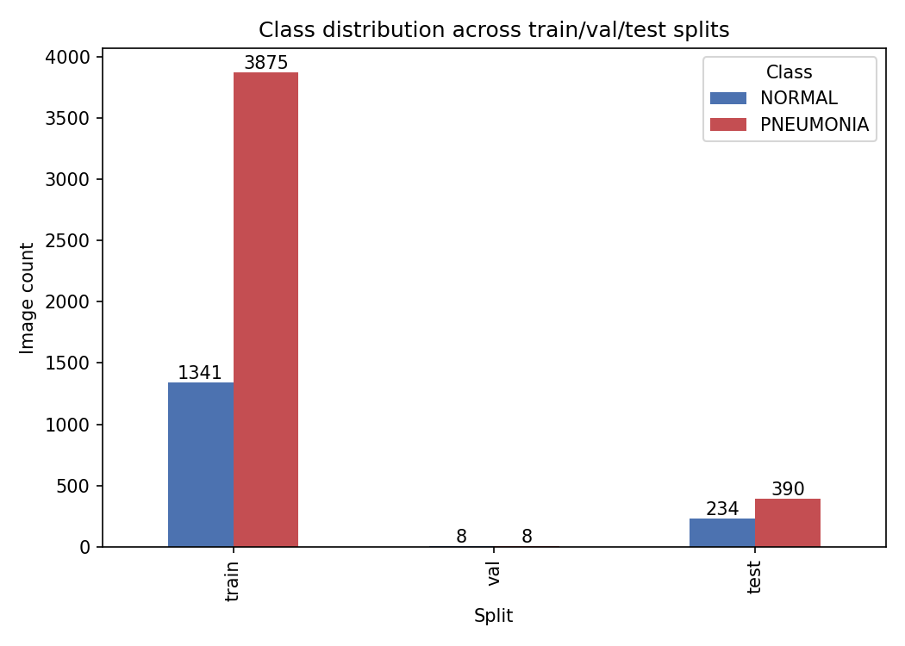
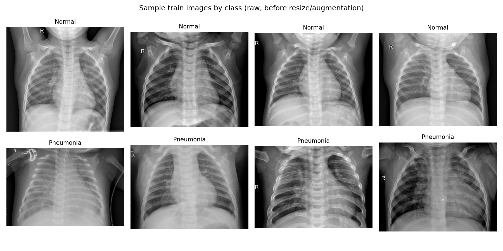
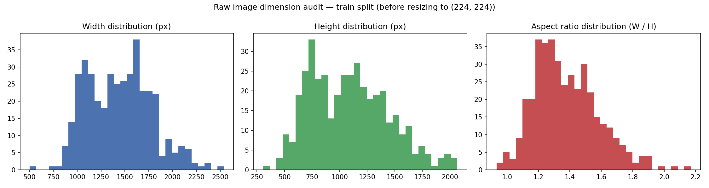
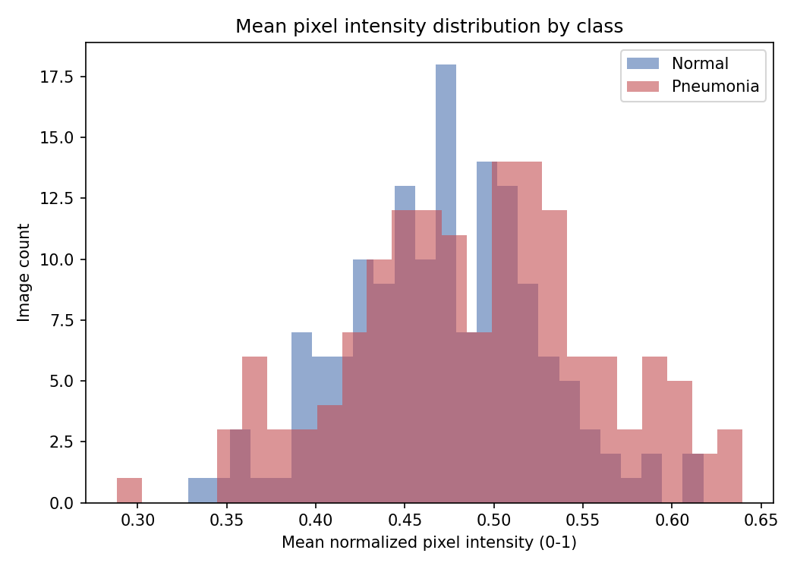
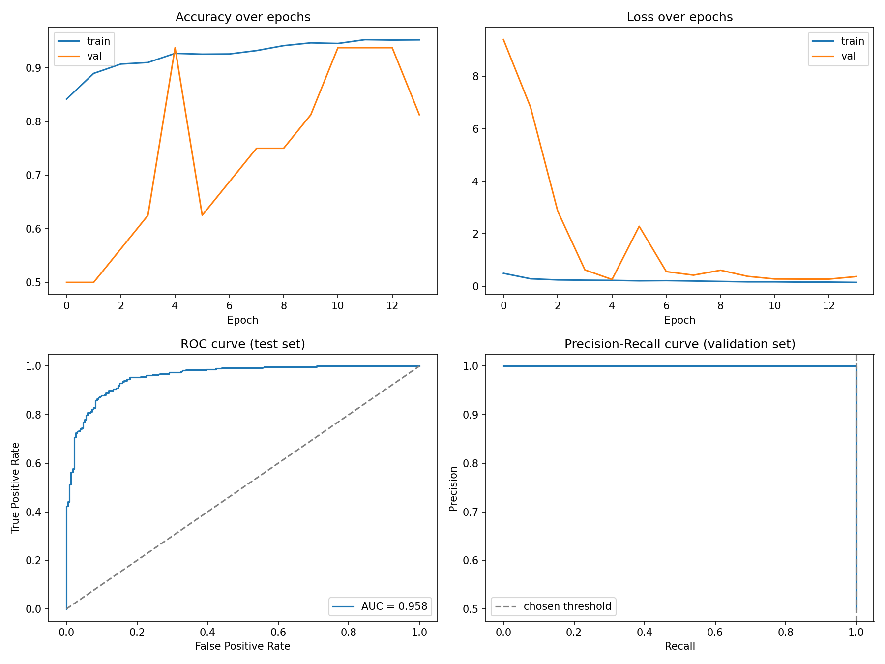
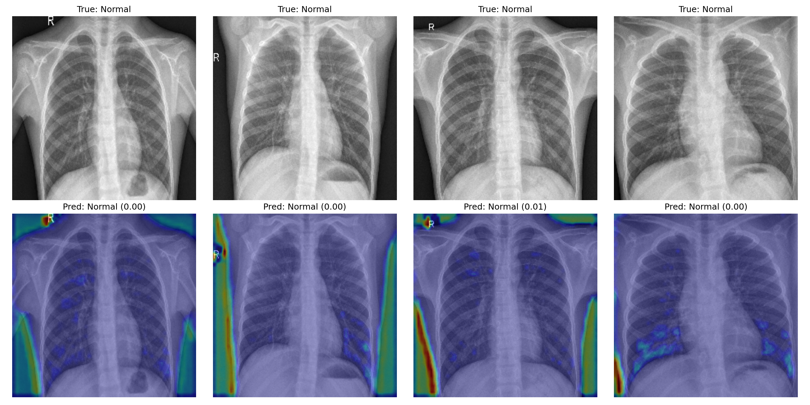

# Pediatric Chest X-Ray Classification — Custom CNN 


## 1. Project background

Pneumonia is one of the leading causes of death among children under five worldwide, and chest X-rays are commonly used to support its diagnosis. However, interpreting pediatric chest X-rays can be challenging due to inter-observer variability, particularly in borderline cases, while access to experienced radiologists may be limited in some healthcare settings.

This project investigates whether a **Convolutional Neural Network (CNN) built entirely from scratch** can learn to distinguish between **Normal** and **Pneumonia** cases from labeled pediatric chest X-ray images. The model uses **no transfer learning and no pretrained weights**, providing a baseline for evaluating the effectiveness of a core CNN architecture for pediatric pneumonia classification.


**Label convention:** `0 = Normal`, `1 = Pneumonia`

**Task framing:** binary image classification, single input (one chest
X-ray image), single output (a probability that the image shows
pneumonia).

---

## 2. Trained artifacts (Hugging Face)

The completed training run (`run_id = 20260825_180317`) is published at:

**https://huggingface.co/robiulhasanjisan88/CNN/tree/main**

| File | Size | What it is |
|---|---|---|
| `pediatric_cxr_cnn_final_20260825_180317.keras` | 155 MB | Final saved model, with weights from the end of training after restoring the best weights via early stopping |
| `best_cxr_cnn_20260825_180317.keras` | 155 MB | Best checkpoint selected by validation AUC during training |
| `run_config_20260825_180317.json` | 357 B | Exact hyperparameters and configuration used for this run |
| `dataset_summary_20260825_180317.csv` | 59 B | Per-split, per-class image counts |
| `training_log_20260825_180317.csv` | 2.47 kB | Per-epoch training and validation metrics, including loss, accuracy, precision, recall, and AUC |
| `diagnostics_20260825_180317.png` | 123 kB | Diagnostic plots including accuracy, loss, ROC, and PR curves |
| `gradcam_examples_20260825_180317.png` | 1.83 MB | Grad-CAM heatmaps overlaid on four sample test images |
| `confusion_matrix_20260825_180317.png` | 35.3 kB | Confusion matrix for the test-set predictions |
| `class_distribution_20260825_180317.png` | 40.1 kB | Class distribution visualization |
| `image_dimensions_20260825_180317.csv` | 14.9 kB | Image dimension statistics |
| `image_dimensions_20260825_180317.png` | 49.2 kB | Visualization of image dimensions |
| `pixel_intensity_20260825_180317.png` | 34.6 kB | Pixel-intensity distribution visualization |
| `sample_images_20260825_180317.png` | 806 kB | Representative sample images from the dataset |

### Load the trained model

The trained Keras model and all associated artifacts are available directly from the Hugging Face repository:

**https://huggingface.co/robiulhasanjisan88/CNN/tree/main**

The repository contains both the final model and the best validation-AUC checkpoint, along with the configuration, training logs, dataset statistics, diagnostic plots, confusion matrix, and Grad-CAM visualizations.

Load the model directly with Keras (Hugging Face Hub integration):

```python
import os
os.environ["KERAS_BACKEND"] = "tensorflow"  
import keras

model = keras.saving.load_model("hf://robiulhasanjisan88/CNN")
```

Or download a specific file directly:

```python
from huggingface_hub import hf_hub_download

path = hf_hub_download(
    repo_id="robiulhasanjisan88/CNN",
    filename="best_cxr_cnn_20260825_180317.keras"
)
```

---

## 3. Repository structure

```
CNN - Chest X-Ray Classification/
├── notebook/                      # full training + evaluation pipeline
├── README.md                      # this file
├── py-code/pediatric_cxr_cnn.py    
├── README.md 
├── report                         # Is only show for github
└── output1/                       # created when the script is run locally
    ├── run_config_<run_id>.json
    ├── dataset_summary_<run_id>.csv
    ├── class_distribution_<run_id>.png     # EDA: class balance by split
    ├── sample_images_<run_id>.png          # EDA: raw sample images by class
    ├── image_dimensions_<run_id>.csv       # EDA: raw width/height/aspect ratio
    ├── image_dimensions_<run_id>.png       # EDA: raw dimension histograms
    ├── pixel_intensity_<run_id>.png        # EDA: mean intensity by class
    ├── training_log_<run_id>.csv
    ├── test_metrics_<run_id>.json
    ├── diagnostics_<run_id>.png
    ├── gradcam_examples_<run_id>.png
    ├── confusion_matrix_<run_id>.png
    ├── best_cxr_cnn_<run_id>.keras
    └── pediatric_cxr_cnn_final_<run_id>.keras
```

The five EDA files (`class_distribution_*`, `sample_images_*`,
`image_dimensions_*.png/.csv`, `pixel_intensity_*`) are outputs from the
EDA section added to the script — see §4.4. As of this run they, along
with `confusion_matrix_<run_id>.png`, have been mirrored to the Hugging
Face repo above alongside the originally published artifacts.

Everything under `output1/` for the published run has been mirrored to the
Hugging Face repo linked above, so you don't need to re-run training just
to inspect results — only to reproduce or extend them.

---

## 4. Dataset

### 4.1 Source and composition

5,863 JPEG chest X-ray images, anterior-posterior view, from pediatric
patients aged 1–5, collected during routine clinical care at a single
hospital. Images are pre-split into `train`, `val`, and `test` folders,
each containing `NORMAL/` and `PNEUMONIA/` subfolders.

### 4.2 Actual split composition (from this run's dataset audit)

| Split | Normal | Pneumonia | Total | Pneumonia:Normal ratio |
|---|---|---|---|---|
| train | 1,341 | 3,875 | 5,216 | 2.89 : 1 |
| val | 8 | 8 | 16 | 1.00 : 1 |
| test | 234 | 390 | 624 | 1.67 : 1 |

Two things stand out from this table and shape the methodology below:

1. **Training-set imbalance.** Pneumonia outnumbers Normal by nearly 3:1
   in training. Left uncorrected, a classifier can reach deceptively high
   accuracy by defaulting toward "Pneumonia" — which is exactly the
   failure mode class weighting  is designed to prevent.
2. **Tiny validation set.** Only 16 total images. This is the original
   dataset's val split as provided, not a split introduced by this
   pipeline. It's small enough that any validation-based decision
   (early-stopping trigger, "best" checkpoint selection, threshold
   tuning) carries a wide margin of noise — a single image flip changes
   validation accuracy by ~6 percentage points. 
### 4.3 Image characteristics

Chest X-rays are single-channel (grayscale) images that this pipeline
loads as 3-channel RGB (channel-replicated) to match the `Conv2D` input
shape and to keep the pipeline architecture-agnostic (the transfer
learning variant needs 3 channels to match ImageNet-pretrained weights,
so both pipelines share this convention for consistency).

### 4.4 Exploratory Data Analysis (EDA)

Four checks run before any modeling touches the data, each producing a
saved figure under `output1/`:

**Class balance across splits** — the same counts from §4.2, visualized.
Makes the ~3:1 Pneumonia:Normal skew in `train` immediately visible next
to the (much smaller and closer to balanced) `val`/`test` splits.



**Raw sample images by class** — four `Normal` and four `Pneumonia`
training images, unresized and unaugmented, side by side. This is a
sanity check that the labels line up with what a human would actually
call Normal vs. Pneumonia before any preprocessing is applied.



**Raw image dimension audit** — width, height, and aspect ratio for a
sample of raw files, computed *before* the pipeline resizes everything to
224×224. This dataset's source images come from varying acquisition
equipment, so raw resolutions differ; the histogram quantifies how much
the mandatory resize is stretching/squashing images relative to their
native aspect ratio.



**Mean pixel intensity by class** — average normalized brightness
(0–1) per image, split by label. A cheap, model-free check for whether
Normal and Pneumonia images differ on a basic global statistic (they can,
since consolidation tends to increase radiographic opacity) — useful
context for interpreting the Grad-CAM results in §10 later.



All four figures, plus the underlying `image_dimensions_<run_id>.csv`,
are written by the new `Exploratory Data Analysis (EDA)` section in
`custom_cnn_pneumonia.py` — added between the dataset audit and the data
pipeline setup, so it captures the data as-is, before any augmentation.

---

## 5. Methodology

### 5.1 Dataset audit 

Before any modeling, `audit_dataset()` walks the `train/val/test`
directories and counts `.jpg/.jpeg/.png` files per class, saving the
result to `dataset_summary_<run_id>.csv`. This turns the imbalance
described above from an assumption into a verified, logged fact that
downstream design decisions (class weighting) can point back to.

### 5.2 Preprocessing and data augmentation

| Setting | Value | Rationale |
|---|---|---|
| Rescale | `1/255` | Normalizes pixel values from `[0, 255]` to `[0, 1]`, standard practice for stable gradient descent |
| Rotation range | ±12° | Simulates minor patient positioning variance without distorting anatomy beyond realism |
| Width/height shift | 8% | Simulates off-center framing |
| Zoom range | 10% | Simulates variable distance/field-of-view |
| Shear range | 8% | Mild geometric distortion for robustness |
| Brightness range | 0.85–1.15 | Simulates exposure/contrast variation across different X-ray machines |
| **Horizontal flip** | **Disabled** | A mirrored chest X-ray is not an anatomically valid view (heart and other organs are not left-right symmetric); flipping would inject invalid training examples. This is a deliberate deviation from typical image-classification templates, most of which enable flipping by default. |
| Fill mode | `constant`, `cval=0.0` | Fills any augmentation-induced empty pixels with black rather than reflecting/wrapping image content, avoiding artificial duplicated anatomy at the edges |

Validation and test generators apply **only** the `1/255` rescale — no
augmentation — so evaluation metrics reflect performance on real,
unmodified clinical images, not augmented variants.

### 5.3 Class imbalance handling

`sklearn.utils.class_weight.compute_class_weight(class_weight="balanced", ...)`
computes a weight for each class inversely proportional to its frequency
in the training set. These weights are passed to `model.fit(...,
class_weight=...)`, which scales the loss contribution of each sample by
its class weight — so a misclassified Normal image (the minority class)
contributes proportionally more to the gradient update than a
misclassified Pneumonia image. This is preferred here over naive
oversampling/undersampling because it doesn't discard any Pneumonia data
or duplicate any Normal data, keeping the full training set intact.

### 5.4 Threshold selection

Model outputs are calibrated probabilities in `[0, 1]`, and the
conventional default is to classify as Pneumonia when probability ≥ 0.5.
Rather than assuming this is optimal, the pipeline:

1. Generates predicted probabilities for the **validation** set.
2. Computes precision, recall, and F1 across the full range of possible
   thresholds via `sklearn.metrics.precision_recall_curve`.
3. Selects the threshold that maximizes F1 for the Pneumonia class.
4. Logs this threshold to `run_config` and applies it to the **test**
   set, while also reporting test performance at the naive 0.5 threshold
   for direct comparison.

For the published run, the tuned threshold was **0.491** — see (Threshold selection via precision-recall trade-off)
for what this means in practice.

### 5.5 Evaluation metrics

- **Accuracy** — overall correctness; can be misleading under class
  imbalance, included for completeness rather than as the primary metric.
- **Precision / Recall / F1 (per class)** — via
  `sklearn.metrics.classification_report`.
- **Confusion matrix** — breaks down true/false positives/negatives.
- **ROC-AUC and ROC curve** — threshold-independent measure of separability
  between classes.
- **Precision-Recall curve** — more informative than ROC under class
  imbalance, and the basis for threshold selection .

For this clinical context, **recall on the Pneumonia class** (i.e.,
minimizing false negatives — missed pneumonia cases) is arguably the
single most clinically important number, since a false negative means a
sick child is told they're healthy.

---

## 6. Model architecture — layer-by-layer rationale

```
Input (224×224×3)
   │
   ├─ Conv2D(32, 3×3, padding=same) → BatchNorm → ReLU → MaxPool(2×2)
   ├─ Conv2D(64, 3×3, padding=same) → BatchNorm → ReLU → MaxPool(2×2)
   ├─ Conv2D(128, 3×3, padding=same) → BatchNorm → ReLU → MaxPool(2×2)
   │
   ├─ Flatten
   ├─ Dense(128, L2=1e-4) → ReLU
   ├─ Dropout(0.5)
   └─ Dense(1) → Sigmoid → P(Pneumonia)
```

| Component | Why it's there |
|---|---|
| 3 convolutional blocks, increasing filters (32→64→128) | Standard CNN feature-extraction pattern: early layers learn low-level features (edges, textures), later layers learn higher-level, more abstract patterns (opacity patterns characteristic of consolidation in pneumonia) |
| `padding="same"` | Preserves spatial dimensions within each conv layer so the 3 pooling steps are the only source of downsampling, giving predictable output size (224 → 112 → 56 → 28 before flattening) |
| **BatchNormalization** after every conv layer | Not in a bare-bones template — added specifically to stabilize gradients and speed up convergence given the moderate (not huge) size of this dataset relative to typical CNN benchmarks |
| MaxPooling(2×2) | Downsamples spatial dimensions, reduces computation, and provides mild translation invariance |
| Flatten → Dense(128) | Compresses the final 28×28×128 feature maps into a single vector, then projects to a 128-unit representation for classification |
| **L2 regularization (1e-4)** on the Dense(128) layer | Penalizes large weights, combined with dropout as a second overfitting defense |
| Dropout(0.5) | Randomly zeroes 50% of activations during training, forcing the network to not over-rely on any single feature — particularly important given the dataset size is modest relative to the model's capacity |
| Dense(1) + Sigmoid | Outputs a single calibrated probability for binary classification |

**Total parameters:** determined at build time by `model.summary()` in
the script (dominated by the Flatten → Dense(128) transition, since the
28×28×128 = 100,352-unit feature map connects to 128 output units).

---

## 7. Training configuration

| Setting | Value |
|---|---|
| Optimizer | Adam |
| Initial learning rate | 1e-4 |
| Loss function | Binary cross-entropy |
| Batch size | 32 |
| Max epochs | 30 |
| Random seed | 42 (applied to both NumPy and TensorFlow) |
| Early stopping | Monitors `val_auc` (mode=max), patience 7, restores best weights on stop |
| LR schedule | `ReduceLROnPlateau` on `val_loss`, factor 0.5, patience 3, floor 1e-7 |
| Checkpointing | Saves best model by `val_auc` to `best_cxr_cnn_<run_id>.keras` |
| Logging | `CSVLogger` records every epoch's train/val metrics to `training_log_<run_id>.csv` |

---

## 8. Findings — full run analysis

Source: `training_log_20260825_180317.csv`, `run_config_20260825_180317.json`.



### 8.1 Training trajectory

| Epoch | Train Acc | Train AUC |   Val Acc |   Val AUC |     LR |
| ----: | --------: | --------: | --------: | --------: | -----: |
|     1 |    84.16% |     0.907 |     50.0% |     0.500 |   1e-4 |
|     3 |    90.70% |     0.971 |     56.3% |     0.688 |   1e-4 |
|     5 |    92.70% |     0.976 |     93.8% |     0.969 |   1e-4 |
|     7 |    92.58% |     0.977 |     68.8% | **1.000** |   1e-4 |
|     8 |    93.21% |     0.981 |     75.0% |     0.938 |   1e-4 |
|    10 |    94.65% |     0.986 |     81.3% | **1.000** |   5e-5 |
|    11 |    94.54% |     0.986 | **93.8%** | **1.000** |   5e-5 |
|    12 |    95.25% |     0.989 | **93.8%** |     0.984 | 2.5e-5 |
|    13 |    95.17% |     0.988 | **93.8%** |     0.984 | 2.5e-5 |
|    14 |    95.21% |     0.990 |     81.3% | **1.000** | 2.5e-5 |

Training was configured for a maximum of **30 epochs**. During training, the `ReduceLROnPlateau` scheduler progressively reduced the learning rate from **1 × 10⁻⁴** to **5 × 10⁻⁵** and subsequently to **2.5 × 10⁻⁵** as the validation loss stabilized. The model achieved its strongest validation performance around **Epochs 11–13**, reaching **93.75% validation accuracy** and a maximum **validation AUC of 1.000**.   

**Interpretation:**
- Training accuracy and AUC improved smoothly and monotonically — no
  signs of divergence or instability in the underlying optimization.
- Validation accuracy swung widely between epochs (50%–93.75%), and
  validation AUC repeatedly hit the ceiling of 1.0. With only 16
  validation images, this is expected noise rather than a meaningful
  signal of the model being "perfect" — a 16-image sample simply doesn't
  have the resolution to distinguish a genuinely excellent model from a
  very good one. **This is the single most important caveat when reading
  this run's results.**
- The learning-rate scheduler fired twice (epoch 9: 1e-4→5e-5; epoch 12:
  5e-5→2.5e-5), both times in response to a validation-loss plateau,
  which is functioning as intended even under a noisy validation signal.

### 8.2 Decision threshold

The F1-maximizing threshold on the validation set was **0.491**,
essentially indistinguishable from the naive default of 0.5 given the
16-image validation set's resolution. In other words, threshold tuning
did not meaningfully change decision behavior for this run — it would
likely matter more with a larger, more representative validation split.

### 8.3 Test-set results

Test-set classification metrics (accuracy, precision, recall, confusion
matrix, ROC-AUC) were generated during the run and printed to console.


**Action needed:** re-run evaluation against the published checkpoint to
populate this nootbook :

```python
import keras
model = keras.saving.load_model("hf://robiulhasanjisan88/CNN")

```

---

## 9. Error analysis and clinical interpretation

Once test-set predictions are available , the confusion matrix
should be read with the following clinical framing in mind:

| | Predicted Normal | Predicted Pneumonia |
|---|---|---|
| **Actual Normal** | True Negative | False Positive (over-diagnosis — child sent for unnecessary follow-up) |
| **Actual Pneumonia** | **False Negative (missed diagnosis — clinically the more dangerous error)** | True Positive |

Given the asymmetric cost of these two error types, a model with slightly
lower overall accuracy but meaningfully higher recall on the Pneumonia
class would generally be preferable to one that optimizes raw accuracy.
This is the reasoning behind reporting per-class recall separately rather
than relying on accuracy alone .

---

## 10. Explainability — Grad-CAM

`gradcam_examples_20260825_180317.png` (on the Hugging Face repo) shows
Grad-CAM heatmaps computed against the final convolutional block
(`conv_block3`) for four sample test images, overlaid on the original
X-ray. Warmer colors indicate regions that most strongly influenced the
model's prediction.



For this particular batch, all four displayed examples are true Normal
cases, correctly predicted with low pneumonia probability (0.01–0.03).
The heatmaps show attention concentrated along image borders and the
spine/midline rather than the lung fields themselves — worth flagging per
the sanity-checking rationale below, since border/edge attention on
*correctly classified* images can still be a sign the model is partly
keying off non-anatomical cues rather than lung tissue, even when the
final prediction is right. A useful follow-up (see §12) would be
re-running this on a batch that includes true Pneumonia examples, to see
whether attention shifts toward the lungs when the model is actually
detecting consolidation.

This serves two purposes:
1. **Interpretability** — a clinician (or reviewer) can visually confirm
   whether the model's attention aligns with lung fields, which builds
   (or undermines) trust in a given prediction.
2. **Sanity-checking** — a model that instead concentrates on image
   borders, text/laterality markers, or other non-anatomical artifacts
   would be a red flag for spurious correlation ("shortcut learning"), a
   known failure mode in medical imaging ML where models learn
   dataset-specific artifacts rather than genuine pathology.

---

## 11. Limitations

- **Tiny validation set (16 images).** The original dataset's val split
  is too small to be a reliable signal for early stopping, checkpoint
  selection, or threshold tuning. All validation-based decisions in this
  run should be treated as indicative rather than statistically robust.
- **Single-hospital data source.** All images come from one hospital,
  meaning the model may have implicitly learned site-specific imaging
  characteristics (equipment calibration, positioning conventions,
  image-processing pipeline) that would not necessarily transfer to
  X-rays from a different institution.
- **Pediatric-only, narrow age range (1–5 years).** Findings should not
  be assumed to generalize to adult chest X-rays or to pediatric patients
  outside this age range.
- **Binary framing only.** The model distinguishes Normal vs. Pneumonia
  but does not attempt to distinguish bacterial vs. viral pneumonia (a
  distinction present in the original dataset's filenames but not used
  as a label here), nor does it detect other pathologies.
- **Not a validated diagnostic tool.** This is a research/educational
  pipeline. It has not undergone the clinical validation, regulatory
  review, or prospective testing required for any diagnostic or
  screening use.

---


## 12. How to reproduce

```bash
pip install tensorflow scikit-learn matplotlib pandas
python custom_cnn_pneumonia.py
```

Before running, update `RUN_CONFIG["data_dir"]` in the script to point at
your local dataset root (organized as `train/val/test`, each with
`NORMAL/` and `PNEUMONIA/` subfolders). The published run used a local
Windows path (`D:\Aweb\as\p1\data`); use a relative or
platform-appropriate path for portability across machines.

All outputs are written under `./output1/`, tagged with a timestamp-based
`run_id`, so repeated runs never overwrite each other's artifacts.

---

## 13. References

- Kermany, D. S., Goldbaum, M., Cai, W., et al. (2018). *Identifying
  Medical Diagnoses and Treatable Diseases by Image-Based Deep Learning.*
  Cell, 172(5), 1122–1131 — the original publication associated with this
  pediatric chest X-ray dataset.
- Selvaraju, R. R., Cogswell, M., Das, A., et al. (2017). *Grad-CAM:
  Visual Explanations from Deep Networks via Gradient-based
  Localization.* ICCV 2017 — method used in Visual diagnostics.
- Ioffe, S., & Szegedy, C. (2015). *Batch Normalization: Accelerating
  Deep Network Training by Reducing Internal Covariate Shift.* ICML 2015
  — basis for the BatchNorm layers in Training callbacks.
