# Bank Term Deposit Subscription Prediction — Logistic Regression


## 1. Business problem

A bank wants to predict whether a customer will subscribe to a **term
deposit** based on demographic attributes and banking behaviour, so that
telemarketing campaigns can be targeted more efficiently — calling
customers more likely to say yes, rather than contacting the full
customer base at random.

**Target variable:** `y` — `yes` (subscribed) or `no` (did not subscribe),
encoded as `1`/`0`.

**Model:** Logistic Regression (as specified in the problem statement),
chosen for its interpretability — bank stakeholders can inspect which
factors increase or decrease subscription likelihood, not just get a
black-box score.

---

## 2. Dataset

**Source:** Bank Marketing Data Set (`bank-full.csv`), UCI Machine
Learning Repository — collected from a Portuguese banking institution's
phone-based marketing campaigns.

**Size:** 45,211 customers, 17 attributes, no missing values in any
column.

| Category | Attributes |
|---|---|
| Demographics | `age`, `job`, `marital`, `education` |
| Financial | `default` (has credit in default?), `balance`, `housing` (housing loan?), `loan` (personal loan?) |
| Campaign contact details | `contact` (contact type), `day`, `month`, `duration` (last call length), `campaign` (# contacts this campaign) |
| Previous campaign history | `pdays` (days since last contact, -1 = never), `previous` (# prior contacts), `poutcome` (outcome of previous campaign) |
| **Target** | `y` |

### Target balance

| Class | Count | Percentage |
|---|---|---|
| No | 39,922 | 88.3% |
| Yes | 5,289 | 11.7% |

The dataset is **imbalanced** roughly 7.5:1 in favor of "No" — this shapes
several methodology choices below (class weighting, stratified splitting,
threshold tuning, and reporting precision/recall/F1 rather than relying
on accuracy alone).

---

## 3. Repository structure

```
bank-marketing-logreg/

├── requirements.txt          
├── .gitignore
│
├── data/
│   └── bank-full.csv         
│
├── notebooks/
│   └── bank.ipynb             # e notebook version of the pipeline
│
├── py-code/
│   └── train.py               # full pipeline: EDA, preprocessing, training, evaluation
│
├── models/
│   └── logreg_deployable_model.pkl   # saved, ready-to-load model (no-duration)
│
└── reports/
    ├── best_threshold.txt             # both tuned thresholds, JSON
    ├── feature_coefficients.csv       # full coefficient table
    ├── missed_subscribers.csv         # error-analysis detail
    └── figures/
        ├── target_distribution.png
        ├── numeric_by_target.png
        ├── correlation_heatmap.png
        ├── categorical_subscription_rates.png
        ├── age_distribution.png
        ├── subscription_rate_by_age_group.png
        ├── monthly_volume_vs_rate.png
        ├── unknown_values_by_column.png
        ├── confusion_matrices.png
        ├── roc_curves.png
        ├── pr_curve.png
        ├── calibration_curve.png
        ├── profit_vs_threshold.png
        └── top_coefficients.png
```

---

## 4. Exploratory data analysis

### 4.1 Target class balance

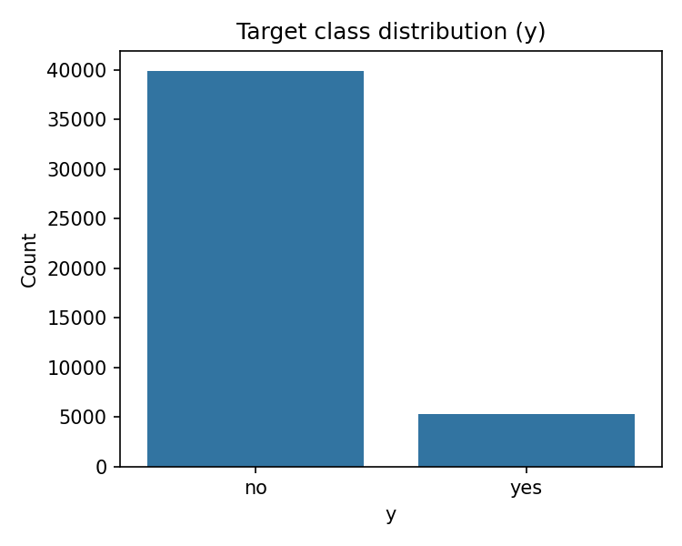

39,922 "no" vs. 5,289 "yes" — the ~88/12 imbalance referenced in Section 2
is visible directly here, and it's the reason class weighting, stratified
splitting, and threshold tuning (Section 6) are all necessary rather than
optional.

### 4.2 Numeric features vs. target

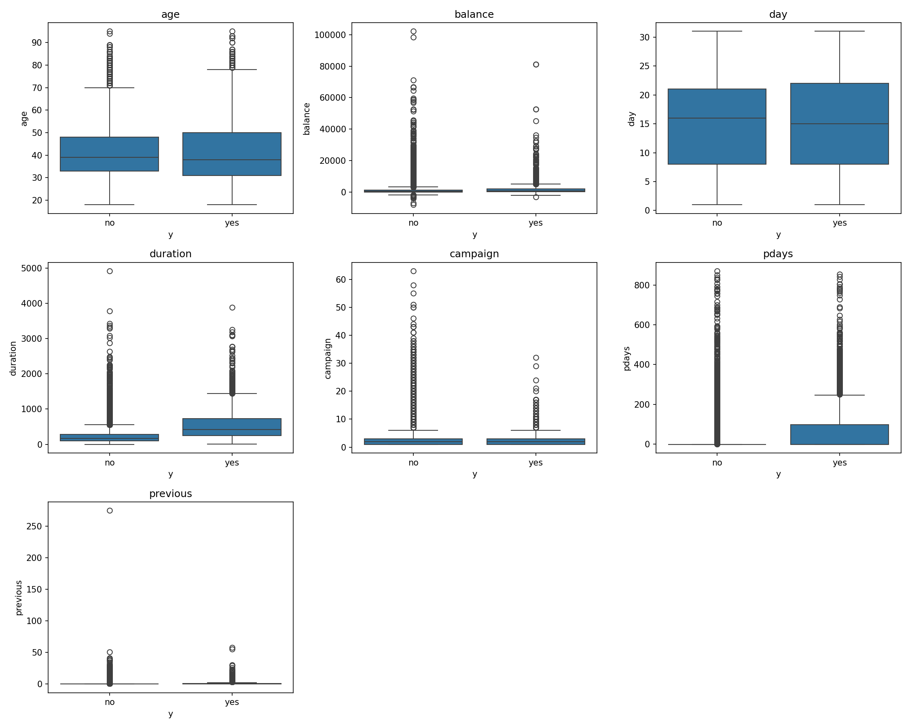

`duration` shows the clearest visual separation between "yes" and "no" —
expected, and exactly why it's handled as a leakage feature (Section 5).
`balance`, `campaign`, and `pdays` all show heavy right-skew with a long
tail of outliers, but no numeric feature besides `duration` separates the
classes strongly on its own — subscription is driven more by *categorical*
and *interaction* effects than by any single numeric variable.

### 4.3 Correlation among numeric features

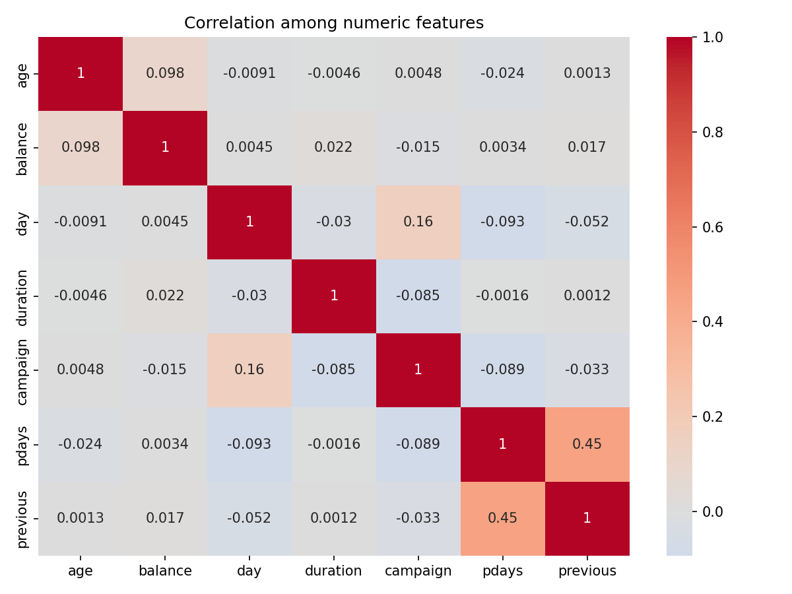

Pairwise correlations are weak across the board (the strongest is
`pdays`/`previous` at 0.45, which makes sense — both describe prior-contact
history). No severe multicollinearity concern for logistic regression.

### 4.4 Subscription rate by categorical feature

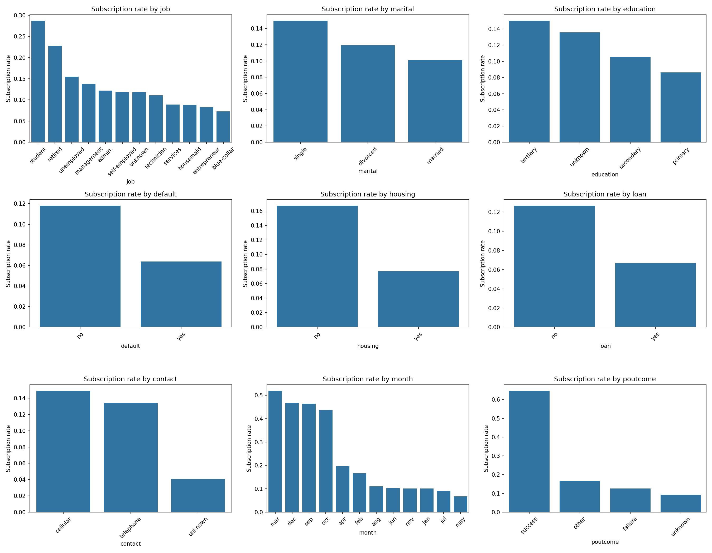

`student` and `retired` job categories, `single` marital status, and
`tertiary` education all skew toward higher subscription rates. `poutcome`
is the standout: customers whose previous campaign ended in `"success"`
subscribe at roughly **5x** the rate of any other `poutcome` group — this
foreshadows it becoming the single strongest model coefficient (Section 8).

### 4.5 Age — distribution and effect on subscription

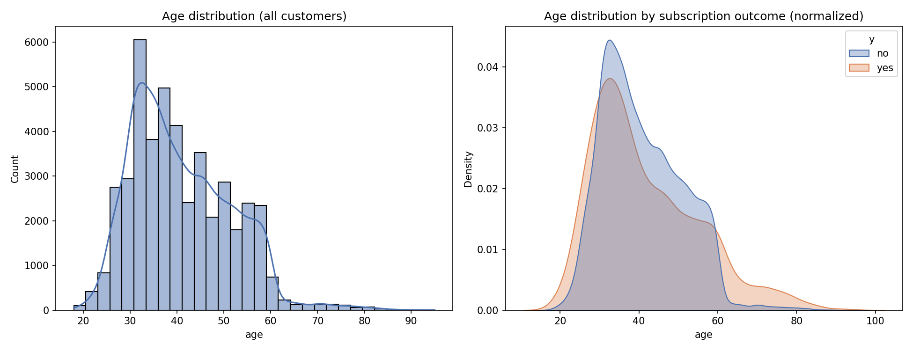

The overall age distribution is concentrated in the 30–50 working-age
range, but the normalized distribution by outcome (right panel) shows
subscribers skew noticeably toward the tails — younger and, especially,
older customers.

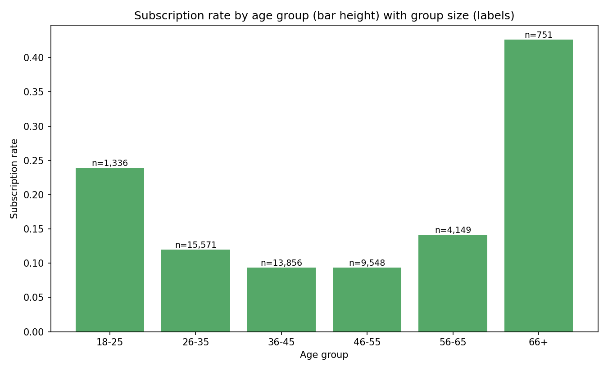

Binning age into groups makes the effect explicit and quantifies it
against group size: the **66+** group subscribes at **~43%**, more than
3x the rate of the 36–55 "core working-age" groups (~9%), even though it's
by far the smallest segment (n=751 vs. n=13,856+9,548 for the two middle
groups). The 18–25 group also over-indexes (~24%). This is consistent
with `job_retired` and `job_student` both being positive coefficients in
the model (Section 8) — age effectively proxies for life stage and
financial priorities.

### 4.6 Timing: call volume vs. conversion rate by month

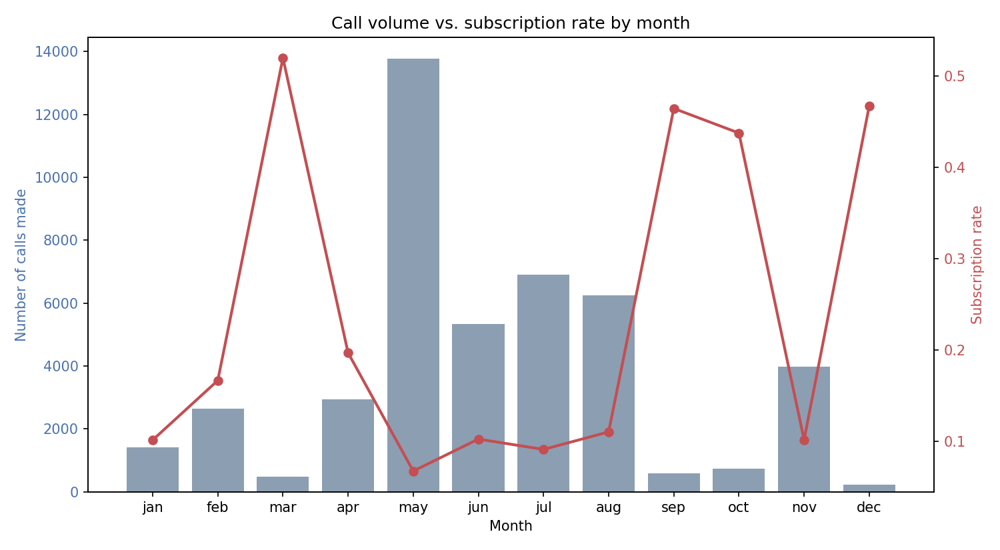

This is one of the more actionable findings in the EDA. **May carries by
far the highest call volume (13,766 calls) but one of the lowest
subscription rates (~6.7%)** — the campaign is spending the bulk of its
calling effort in the month that converts worst. Meanwhile **March,
September, October, and December have low call volumes but conversion
rates of 44–52%** — 6–8x higher than May. This mismatch between *where
effort is spent* and *where it converts* is a direct, low-effort
operational lever independent of the model itself (see Recommendation in
Section 15).

### 4.7 "Unknown" category frequency

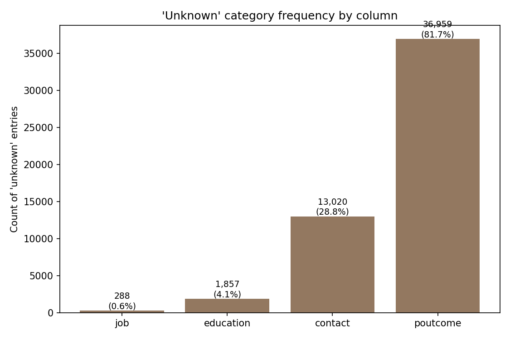

Quantifying the missingness-as-category issue flagged below: `poutcome`
is `"unknown"` for **81.7%** of customers (mostly those never contacted
before), `contact` method is unknown for 28.8%, `education` for 4.1%, and
`job` for only 0.6%. Because `poutcome_unknown` is so dominant, it's worth
distinguishing structural missingness (never previously contacted — which
`was_previously_contacted` already captures explicitly, Section 6.2) from
genuine data-quality gaps (`contact_unknown`, which the model picks up as
a meaningfully negative coefficient — Section 8).

### 4.8 Summary of key EDA takeaways

- **No missing values** in any of the 17 columns — but several categorical
  columns (`job`, `education`, `contact`, `poutcome`) contain an
  `"unknown"` category, which is effectively a missingness indicator that
  one-hot encoding treats as its own category (quantified in 4.7 above).
- **Numeric features show weak pairwise correlation** with each other
  (no severe multicollinearity concern for logistic regression).
- **`pdays` = -1** for the majority of customers, meaning most have never
  been contacted in a prior campaign. This sentinel value is handled
  explicitly — see Section 6.2.
- **Subscription rate varies substantially by month** (4.6) and by
  **previous campaign outcome** (4.4) — customers whose previous
  campaign outcome was `"success"` subscribe at a much higher rate than
  average, which shows up clearly in the feature importance results
  (Section 8).
- **Age has a non-linear ("U-shaped") relationship with subscription**
  (4.5) — the youngest and oldest customers convert best, while the
  30–55 core working-age segment converts worst despite being the
  largest group by far.
- **Call effort and conversion rate are currently mismatched by month**
  (4.6) — the highest-volume month (May) converts worst, while several
  low-volume months convert 6–8x better.

---

## 5. The `duration` leakage issue

`duration` (last contact call length in seconds) is **known only after
the call has ended** — meaning it cannot be used to decide, in advance,
which customers to call. A `duration` of 0 almost perfectly predicts
"no" (confirmed below):

```
Rows with duration == 0: 3
Of those, y == 'no' in all 3 cases: True
```

**This pipeline trains and reports two models:**

| Model | Includes `duration`? | Use case |
|---|---|---|
| **No-duration model** | No | The **deployable** model — usable to *decide who to call*, since duration isn't known until after the call |
| **With-duration model** | Yes | A reference/upper-bound model — shows what performance looks like if duration were available, useful for context but **not usable for real targeting decisions** |

All headline conclusions treat the **no-duration model** as the one that
answers the actual business problem.

---

## 6. Methodology

### 6.1 Train/test split
80/20 split, **stratified** on `y` (Train: 36,168 customers, Test: 9,043
customers).

### 6.2 Feature engineering — fixing the `pdays` sentinel
`pdays = -1` means "never previously contacted." It is **not** a genuine
numeric quantity, so scaling it as-is drags the feature's mean downward
artificially and gives the model a distorted signal. Fixed with two
changes:

1. **`was_previously_contacted`** — a binary flag (`1` if `pdays != -1`,
   else `0`), so the model has an explicit, clean signal for prior contact
   history.
2. **`pdays_clean`** — `pdays` with `-1` replaced by `0` before scaling,
   so the standardized numeric feature reflects "how many days since last
   contact, for those who were previously contacted" rather than a
   nonsensical negative value pulling the whole distribution off-center.

### 6.3 Preprocessing pipeline
Built with `sklearn.compose.ColumnTransformer` (fit only on training
data, applied consistently to test data — no leakage):

- **Numeric features** (`age`, `balance`, `day`, `campaign`,
  `pdays_clean`, `previous`, and `duration` for the reference model):
  standardized via `StandardScaler`.
- **Categorical features** (`job`, `marital`, `education`, `default`,
  `housing`, `loan`, `contact`, `month`, `poutcome`): one-hot encoded via
  `OneHotEncoder(drop="first", handle_unknown="ignore")`.
- **Engineered feature** (`was_previously_contacted`): passed through
  unchanged.

### 6.4 Handling class imbalance
`LogisticRegression(class_weight="balanced")` reweights the loss function
inversely proportional to class frequency, so the ~7.5:1 imbalance
doesn't cause the model to trivially predict "no" for everyone.

### 6.5 Hyperparameter tuning
`GridSearchCV` over regularization strength `C ∈ {0.01, 0.1, 1, 10, 100}`,
5-fold **stratified** cross-validation, scored on **ROC-AUC**.

### 6.6 Decision threshold tuning — two separate objectives
Model probabilities are calibrated against **two different criteria**,
using a validation split carved out of the training data only (never the
test set, to avoid leaking test information into threshold selection):

1. **F1-optimal threshold** — maximizes the harmonic mean of precision
   and recall. Treats false positives and false negatives as roughly
   equally costly.
2. **Profit-optimal threshold** — maximizes `(TP × profit_per_subscription)
   − (calls_made × cost_per_call)`, swept across candidate thresholds on
   the validation split. This does **not** assume false positives and
   false negatives cost the same — see Section 9 for why this matters a
   great deal here.

---

## 7. Results

### 7.1 Cross-validation model selection

| Model | Best `C` | CV ROC-AUC |
|---|---|---|
| No-duration (deployable) | 0.1 | 0.764 |
| With-duration (reference) | 0.1 | 0.910 |

### 7.2 Test-set performance across thresholds (no-duration model)

| Threshold strategy | Value | Accuracy | Precision | Recall | F1 | ROC-AUC | PR-AUC |
|---|---|---|---|---|---|---|---|
| Default | 0.500 | 75.5% | 26.8% | 63.3% | 0.377 | 0.773 | 0.409 |
| F1-optimal | 0.661 | 87.9% | 48.2% | 42.3% | 0.450 | 0.773 | 0.409 |
| Profit-optimal | 0.110 | 12.7% | 11.8% | 99.8% | 0.211 | 0.773 | 0.409 |

*(ROC-AUC and PR-AUC are threshold-independent, so they're identical
across rows — only the classification metrics change with threshold.)*

**With-duration reference model** (threshold 0.5): Accuracy 84.5%,
Precision 41.7%, Recall 81.4%, F1 0.551, ROC-AUC 0.908.

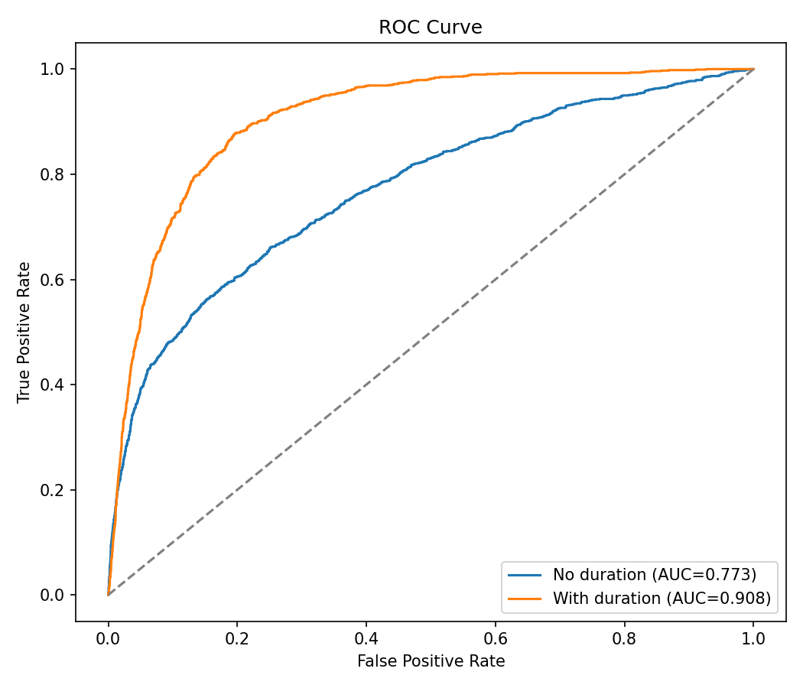

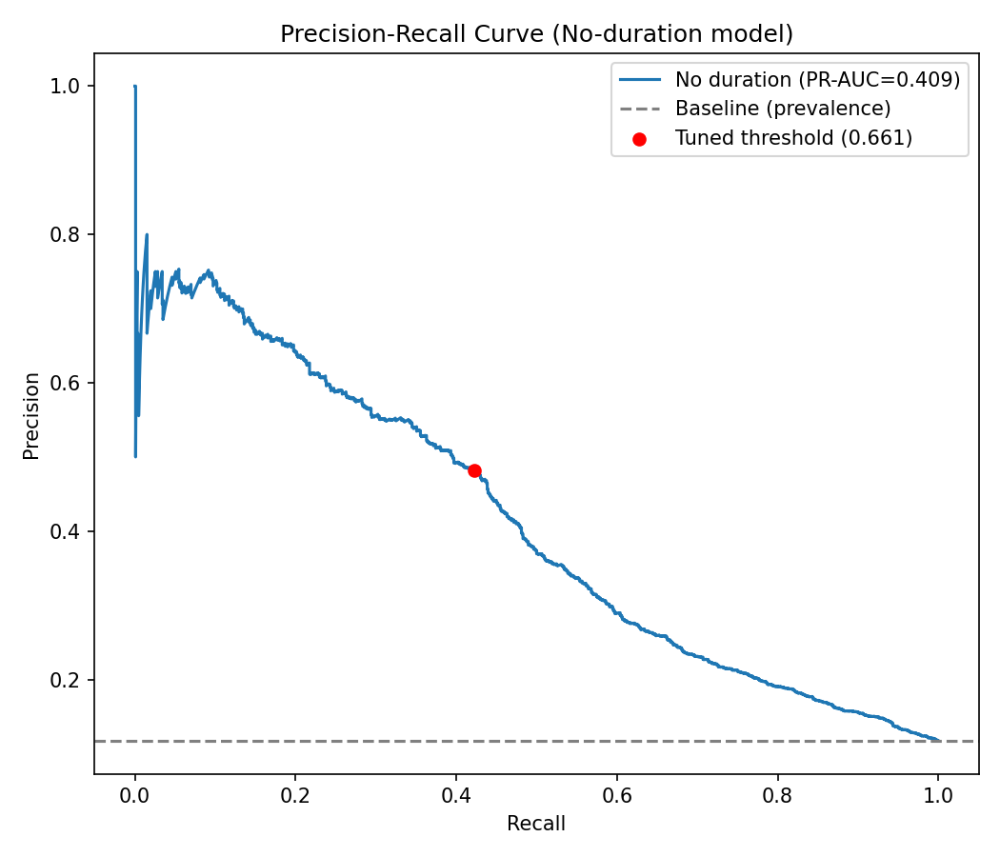

### 7.3 Confusion matrix — F1-optimal threshold, no-duration model

| | Predicted No | Predicted Yes |
|---|---|---|
| **Actual No** | 7,504 | 481 |
| **Actual Yes** | 611 | 447 |

### 7.4 Confusion matrix — profit-optimal threshold, no-duration model

| | Predicted No | Predicted Yes |
|---|---|---|
| **Actual No** | 91 | 7,894 |
| **Actual Yes** | 2 | 1,056 |

Notice how different these two confusion matrices are — this is the
direct consequence of optimizing for two different objectives, discussed
next.

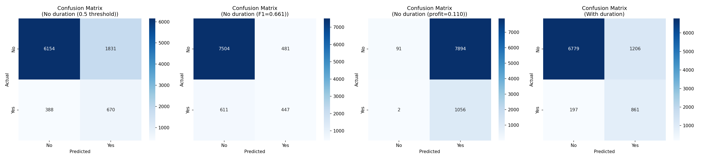

---

## 8. Feature importance

Full coefficient table: `reports/feature_coefficients.csv`. Visualized below.

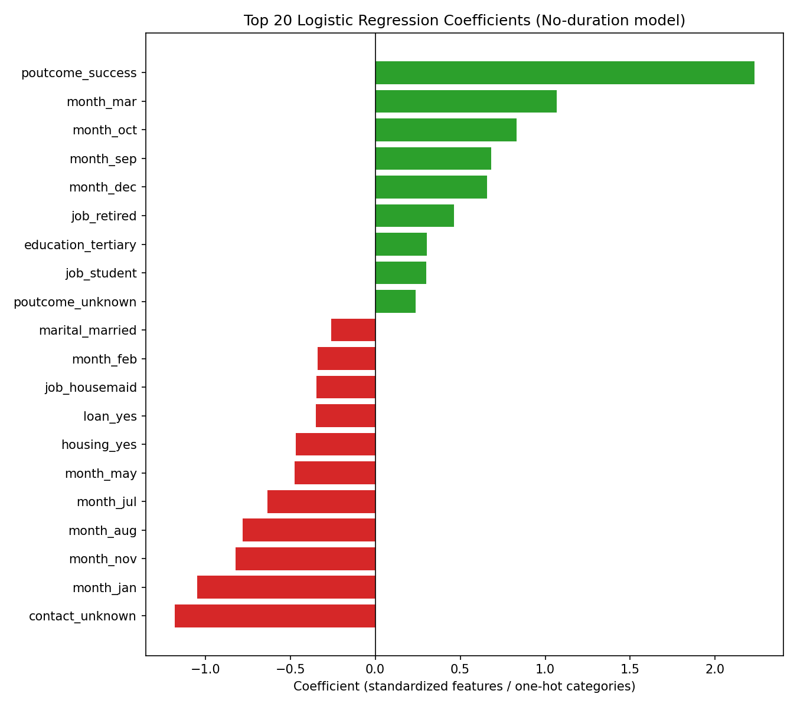

**Top positive drivers of subscription:**

| Feature | Coefficient | Interpretation |
|---|---|---|
| `poutcome_success` | +2.23 | By far the strongest signal — prior campaign success predicts future success |
| `month_mar` | +1.07 | March contacts show notably higher subscription rates |
| `month_oct` | +0.83 | Same pattern for October |
| `month_sep` | +0.68 | Same pattern for September |
| `month_dec` | +0.66 | Same pattern for December |
| `job_retired` | +0.46 | Retirees subscribe at higher-than-average rates |

**Top negative drivers:**

| Feature | Coefficient | Interpretation |
|---|---|---|
| `contact_unknown` | -1.18 | Unknown/unrecorded contact method — likely a proxy for lower-quality contact data |
| `month_jan` | -1.05 | January contacts show notably lower subscription rates |
| `month_nov` | -0.82 | Same pattern for November |
| `month_aug` | -0.78 | Same pattern for August |
| `month_jul` | -0.64 | Same pattern for July |
| `housing_yes` | -0.47 | Customers with an existing housing loan are less likely to add a term deposit |

**Takeaway:** prior campaign success dominates every other feature, and
**contact month** matters more than most demographic variables — a
timing effect worth investigating operationally.

---

## 9. Decision threshold: F1-optimal vs. profit-optimal

This is the most important methodological addition in this version of
the analysis, and it produces a genuinely counter-intuitive result.

**The two thresholds found are very different: 0.661 (F1) vs. 0.110
(profit)** — see below. Why such a large gap?

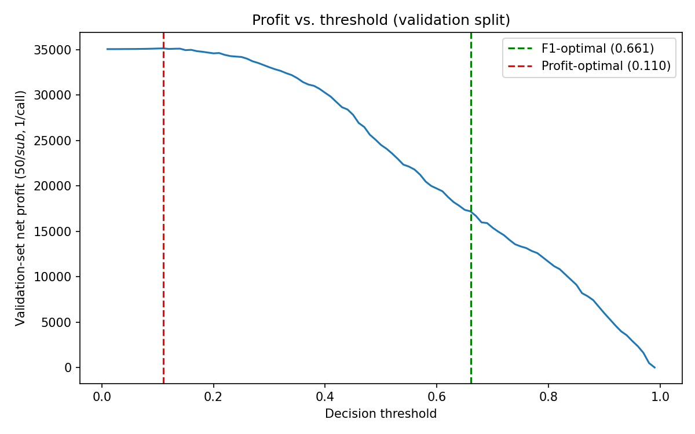

F1 implicitly treats a false positive and a false negative as **equally
costly**. But under the stated unit economics (illustrative, adjust to
the bank's real numbers):

- **Cost of a false positive** (calling someone who says no): **$1**
  (wasted call-center time)
- **Cost of a false negative** (missing someone who would say yes): **$50**
  in forgone profit

That's a **50:1 cost asymmetry**. When missing a "yes" is that much more
expensive than a wasted call, the profit-maximizing strategy is to call
almost everyone — which is exactly what the sweep found: at the
profit-optimal threshold (0.110), the model calls 8,950 of 9,043 test
customers (99%) and misses only 2 of 1,058 actual subscribers.

### 9.1 Profit comparison (test set, $50/subscription, $1/call)

| Strategy | Calls made | True positives caught | Net profit |
|---|---|---|---|
| Default threshold (0.5) | 2,501 | 670 | $30,999 |
| F1-optimal threshold (0.661) | 928 | 447 | $21,422 |
| **Profit-optimal threshold (0.110)** | 8,950 | 1,056 | **$43,850** |
| Baseline — call everyone | 9,043 | 1,058 | $43,857 |

The profit-optimal strategy nets **$22,428 more** than the F1-optimal
strategy on this test set — a large, real difference that F1 alone would
never surface, because F1 doesn't know that a missed sale is 50x more
costly than a wasted call.

---

## 10. Is the model even worth using here? A candid look

The table above contains an important, slightly uncomfortable finding:
**the profit-optimal strategy ($43,850) is barely better than just
calling every single customer ($43,857 — actually $7 *higher*)**. In
other words, under these specific unit economics, the model's targeting
adds essentially **no profit value** over calling everyone — because
when a missed sale costs 50x more than a wasted call, and even a low
base rate of "yes" (11.7%) is common enough, the math almost always says
"just call them."

This is not a failure of the model — it's a property of the assumed cost
structure, and it's worth stating plainly rather than glossing over:

- If `cost_per_call` is closer to real call-center economics (e.g., $5–15
  for agent time, script, and follow-up, rather than $1), the
  profit-optimal threshold would move meaningfully higher, and the
  model's targeting would start to add real value over blanket calling.
- If `profit_per_subscription` is lower (e.g., net of overhead,
  incentives, or account-servicing costs, rather than gross product
  profit), the same shift would occur.
- **The right next step is a sensitivity analysis** — re-run the
  threshold sweep (Section 6.6 of the script) across a range of plausible
  `cost_per_call` / `profit_per_subscription` values the bank actually
  uses, rather than trusting the single illustrative pair used here.

This is exactly the kind of finding a good analysis should surface rather
than hide — it directs the bank's next question toward "what are our
real unit economics?" rather than "is the model good?"

---

## 11. Probability calibration

`reports/figures/calibration_curve.png` checks whether a predicted probability of,
say, 0.7 actually corresponds to ~70% of those customers subscribing.

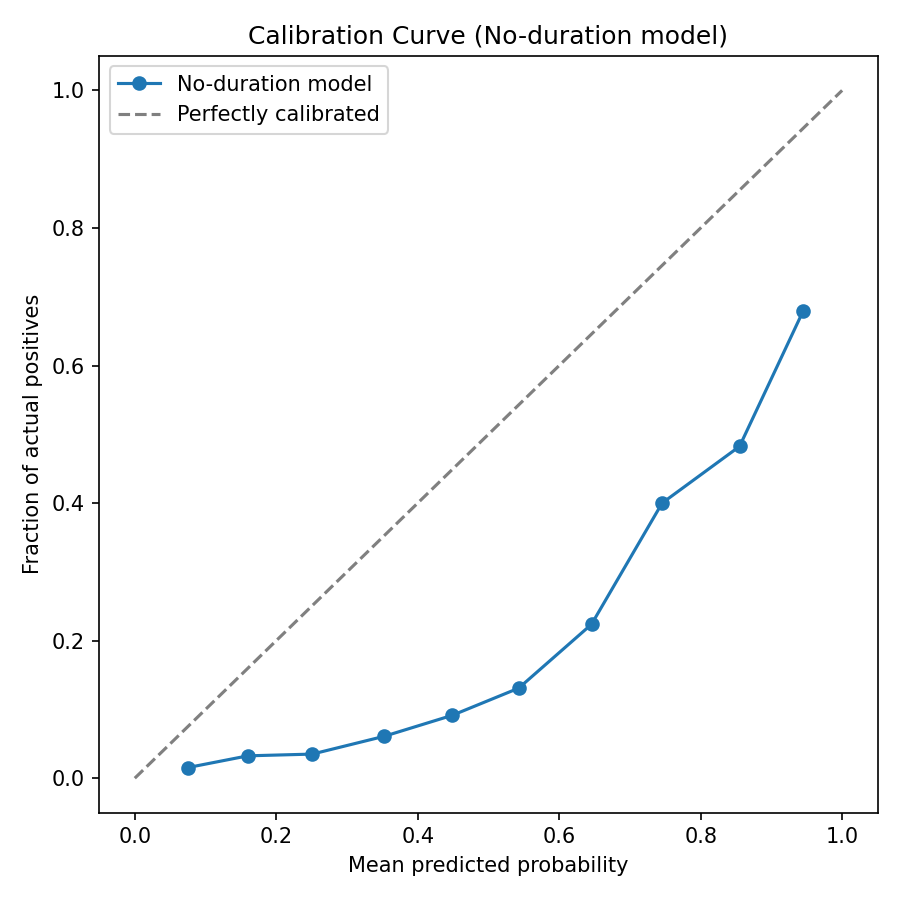

**Finding: the model is not well-calibrated — it's systematically
overconfident.** The calibration curve sits below the diagonal across
the full range: for example, customers the model assigns ~0.65
probability actually subscribe only ~23% of the time.

**Why:** `class_weight="balanced"` reweights the loss function to treat
the minority class as if it were much more common than it actually is —
which improves recall and ranking quality (ROC-AUC, PR-AUC are
unaffected, since they only depend on relative ordering), but it distorts
the *absolute* probability values away from true frequencies.

**Practical implication:** the threshold-sweep approach used in Section
9 sidesteps this problem — it directly measures realized profit at each
threshold rather than trusting the probabilities as literal likelihoods,
so the profit-optimal threshold found is still valid. But if the raw
probability output is ever surfaced to a human user (e.g., "this customer
has a 70% chance of subscribing"), it should first be recalibrated (e.g.,
via `sklearn.calibration.CalibratedClassifierCV` with Platt scaling or
isotonic regression) — otherwise that number will overstate true
likelihood.

---

## 12. Error analysis

Using the **profit-optimal threshold** (the deployable strategy), only 2
of 1,058 actual subscribers were missed on the test set — full details in
`reports/missed_subscribers.csv`. Because so few are missed at this
aggressive threshold, there isn't a large enough sample to draw
meaningful patterns from the 2 missed cases alone.

A more informative comparison is the **F1-threshold** error profile
(deprioritized for deployment, but useful diagnostically): under that
threshold, 611 of 1,058 subscribers (57.8%) were missed. Comparing missed
vs. correctly-caught subscribers' numeric profiles:

| Feature (mean) | Missed subscribers | Caught subscribers |
|---|---|---|
| Age | 41.6 | 42.3 |
| Balance | $1,489 | $1,998 |
| Campaign contacts | 2.37 | 1.74 |
| Days since last contact (`pdays_clean`) | 48.9 | 105.1 |
| Previous contacts | 0.58 | 1.98 |

**Pattern:** missed subscribers tend to have **lower account balances**,
**more contacts in the current campaign** (possibly indicating a harder
sell, or fatigue effects working against the model), and **far fewer
previous-campaign contacts** — consistent with `poutcome`/`previous`
being strong positive predictors (Section 8). Customers with little or no
campaign history are intrinsically harder for the model to score
confidently, since it has the least behavioural signal about them.

---

## 13. Deployment artifacts

- **`models/logreg_deployable_model.pkl`** — the fitted no-duration
  pipeline (preprocessing + logistic regression), saved via `joblib`.
  Load with:
  ```python
  import joblib
  model = joblib.load("models/logreg_deployable_model.pkl")
  # (path is relative to the project root)
  proba = model.predict_proba(new_customers_df)[:, 1]
  ```
- **`reports/best_threshold.txt`** — both tuned thresholds in JSON format,
  with `profit_optimal_threshold` flagged as the recommended deployment
  choice given Section 9's findings (pending the sensitivity analysis
  recommended in Section 10).

---

## 14. Limitations

- **`duration` cannot be used for real targeting decisions** — the
  no-duration model (ROC-AUC 0.773) is the realistic ceiling for this
  task; the with-duration model (ROC-AUC 0.908) is a reference point only.
- **The profit unit economics are illustrative placeholders**
  ($1/call, $50/subscription), not the bank's real numbers — see Section
  10 for why this matters enormously for which threshold is actually
  optimal.
- **Miscalibrated probabilities** (Section 11) mean raw output
  probabilities should not be presented to end users as literal
  likelihoods without recalibration.
- **Single-country, single-institution data** — behavioural patterns
  (e.g., which months work best) may not transfer to a different
  institution or economic period.
- **No temporal validation** — the split is a random stratified split,
  not a time-based one; a real deployment test would train on earlier
  campaigns and test on a later one.
- **Logistic regression assumes linearity** in log-odds space — it may
  under-fit genuinely non-linear interactions a tree-based model could
  capture.

---


## 15. How logistic regression works, mathematically

This section walks through the mechanics behind the numbers reported
above — useful context for interpreting the coefficients in Section 8
and the threshold behaviour in Section 9.

### 15.1 From a linear score to a probability

Logistic regression starts the same way linear regression does: it
computes a weighted sum of the input features (the "linear predictor" or
**log-odds**, denoted `z`):

```
z = β0 + β1·x1 + β2·x2 + ... + βn·xn
```

where each `xi` is a (scaled, one-hot-encoded) feature — e.g. `age`,
`balance`, `job_retired`, `poutcome_success` — and each `βi` is the
learned coefficient reported in Section 8.

The problem with stopping there is that `z` can range from `-∞` to `+∞`,
but a probability must sit between 0 and 1. Logistic regression fixes
this by passing `z` through the **sigmoid (logistic) function**:

```
p = 1 / (1 + e^(-z))
```

This squashes any real number into the `(0, 1)` range, producing
`p = P(y = 1 | x)` — the model's estimated probability that a given
customer subscribes.

### 15.2 Why "log-odds" is the right way to think about the coefficients

Rearranging the sigmoid shows that `z` is literally the **log-odds** of
subscribing:

```
z = ln( p / (1 - p) )
```

This is why each coefficient in Section 8's table is interpreted the way
it is: `poutcome_success` at `+2.23` means that, holding every other
feature fixed, having a previously successful campaign outcome adds 2.23
to the log-odds of subscribing — equivalently, it multiplies the *odds*
of subscribing by `e^2.23 ≈ 9.3x`. A negative coefficient like
`contact_unknown` at `-1.18` shrinks the odds by a factor of
`e^-1.18 ≈ 0.31` (roughly a 69% reduction in odds), all else equal.

### 15.3 How the coefficients are learned

The `β` values aren't chosen by a formula the way ordinary linear
regression's are — they're found by **maximum likelihood estimation
(MLE)**: pick the coefficients that make the observed outcomes
(`y = 0`/`1` for every training customer) as probable as possible under
the model. In practice this means minimizing the **log-loss (binary
cross-entropy)**:

```
Loss = -1/N * Σ [ yi·ln(pi) + (1 - yi)·ln(1 - pi) ]
```

`scikit-learn`'s `LogisticRegression` minimizes this loss numerically
(via an iterative solver), with an added **L2 regularization** penalty
controlled by `C` — this is exactly the hyperparameter swept in the
`GridSearchCV` step (Section 6.5): smaller `C` means stronger
regularization (coefficients pulled toward zero, reducing overfitting),
larger `C` lets the coefficients fit the training data more closely.

### 15.4 Where `class_weight="balanced"` fits in

Because the dataset is ~88/12 imbalanced (Section 2), the loss above
would be dominated by getting the majority "no" class right, since it
appears 7.5x more often. `class_weight="balanced"` multiplies each
training example's contribution to the loss by a weight inversely
proportional to its class frequency, effectively forcing the optimizer
to pay as much attention to the rare "yes" cases as the common "no"
cases. This is precisely why it improves recall on the minority class
(Section 6.4) but also why the resulting probabilities are no longer
well-calibrated (Section 11) — the loss the model actually minimized was
computed on artificially reweighted data, not the true class
frequencies.

### 15.5 From probability to decision: the threshold

The sigmoid produces a continuous probability, but a calling decision is
binary (call / don't call). That conversion happens by comparing `p` to
a **threshold** `t`: predict "yes" if `p ≥ t`, else "no". This single
number is what Section 9 shows can swing dramatically (0.661 vs. 0.110)
depending on whether the goal is a balanced F1 score or maximum profit
under an asymmetric cost structure — the underlying model and its
coefficients don't change at all; only where the probability line gets
cut does.

---

## 16. How to reproduce

```bash
git clone <repo-url>
cd bank-marketing-logreg
pip install -r requirements.txt

cd py-code
python train.py
```

`data/bank-full.csv` (semicolon-delimited) is already in place; `train.py`
reads it via a relative path (`../data/bank-full.csv`), so the script must
be run from inside `py-code/`. All plots are written to `reports/figures/`,
the coefficient table and error-analysis CSV to `reports/`, the trained
model to `models/`, and both tuned thresholds to
`reports/best_threshold.txt`. The four additional EDA plots described in
Sections 4.5–4.7 (`age_distribution.png`, `subscription_rate_by_age_group.png`,
`monthly_volume_vs_rate.png`, `unknown_values_by_column.png`) are
generated as part of the same `train.py` run — there's no separate script
to run.

Alternatively, open `notebooks/bank.ipynb` to explore the same pipeline
interactively, cell by cell.
